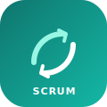

<!-- Animated banner -->
<a href="https://lcarlini.github.io/lcarlini/">
  
</a>

<!-- Typing tagline -->
<p align="center">
  <a href="https://lcarlini.github.io/lcarlini/">
    
  </a>
</p>

<p align="center">
  <a href="https://lcarlini.github.io/lcarlini/"></a>
  <a href="https://www.linkedin.com/in/leandro-carlini/"></a>
  <a href="mailto:leandrocarlini@gmail.com"></a>
  
</p>

<br>

## 👋 About

```yaml
name: Leandro Carlini Mingorance
role: Staff Software Engineer · Senior Software Engineer · Solutions Architect · Tech Lead
experience: 15+ years shipping production software
regions: [ United States, Canada, Europe, LATAM ]
focus: [ Cloud Architecture, Distributed Systems, Backend, AI-Assisted Delivery ]
location: Remote · Brazil
currently: Architecting scalable, cloud-native platforms on .NET + Azure/AWS
```

I engineer **distributed, cloud-native systems** that stay reliable under load and clear to reason about.
My work lives in the hard parts of software — **architecture, scalability, and system reliability** — where good
decisions compound into real business impact. I've worked on **internal product initiatives** and with
**international teams across cultures**, in English-speaking environments (including on-site in the Netherlands).

- 🏗️ Architecting **event-driven** & **microservice** platforms on **Azure** and **AWS**
- 🚀 Modernizing legacy systems and leading **multi-cloud migrations**
- 🔬 Designing **high-throughput data pipelines** and distributed systems
- 🤖 Applying **AI-assisted workflows** to accelerate delivery & developer productivity
- 🌍 Collaborating daily in **English** with multicultural, international engineering teams
- 🧭 Leading global teams as **Tech Lead** — mentoring, reviews, and architecture standards

<br>

## 📊 Impact at a glance

<table>
  <tr>
    <td align="center" width="25%"><h2>15+</h2>yrs in production</td>
    <td align="center" width="25%"><h2>$8M+</h2>revenue driven</td>
    <td align="center" width="25%"><h2>99.9%</h2>system uptime</td>
    <td align="center" width="25%"><h2>4</h2>global regions</td>
  </tr>
  <tr>
    <td align="center"><h2>70%</h2>faster provisioning</td>
    <td align="center"><h2>60%</h2>less manual effort</td>
    <td align="center"><h2>Millions</h2>records / pipeline</td>
    <td align="center"><h2>∞</h2>curiosity</td>
  </tr>
</table>

<br>

## 🛠️ Tech Stack

**Languages & Frameworks**<br>


**Cloud & DevOps**<br>


**Data & Architecture**<br>


**Practices**<br>


<br>

## 🎓 Education

**Bachelor's Degree in Computer Engineering** · Centro Universitário Facens (Sorocaba College of Engineering)  
*Systems Analysis, Development, and Architecture* · Graduated December 2012 · 5-year program

A five-year immersion in designing, developing, and managing computational systems — hardware, software, networks, and embedded systems — with a focus on building innovative solutions across communications, automation, and AI.

<br>

## 🏅 Certifications

Credentials that map to real delivery problems — cloud apps, security, AI, DevOps, and team flow.

<table>
  <tr>
    <td width="90" align="center" valign="top">
      <a href="https://learn.microsoft.com/en-us/users/leandrocarlinimingorance-2739/credentials/dd379b8ce8959585"></a>
    </td>
    <td valign="top">
      <strong><a href="https://learn.microsoft.com/en-us/users/leandrocarlinimingorance-2739/credentials/dd379b8ce8959585">Microsoft Certified: Azure Developer Associate</a></strong> · Microsoft · Dec 2022<br>
      <em>Solves:</em> Building, deploying, and troubleshooting Azure apps that must scale, integrate, and stay maintainable in production.
    </td>
  </tr>
  <tr>
    <td width="90" align="center" valign="top">
      <a href="https://www.credly.com/badges/ae3377eb-2bd3-4b1a-8504-cc6f70cf24b1/linked_in_profile"></a>
    </td>
    <td valign="top">
      <strong><a href="https://www.credly.com/badges/ae3377eb-2bd3-4b1a-8504-cc6f70cf24b1/linked_in_profile">Microsoft Certified: Security, Compliance, and Identity Fundamentals</a></strong> · Microsoft · Oct 2022<br>
      <em>Solves:</em> Designing systems that protect data, manage identity correctly, and meet security &amp; compliance expectations.
    </td>
  </tr>
  <tr>
    <td width="90" align="center" valign="top">
      <a href="https://www.credly.com/badges/57c4fb02-de74-426e-8c02-319be54708d9/linked_in_profile"></a>
    </td>
    <td valign="top">
      <strong><a href="https://www.credly.com/badges/57c4fb02-de74-426e-8c02-319be54708d9/linked_in_profile">Microsoft Certified: Azure AI Fundamentals</a></strong> · Microsoft · Oct 2022<br>
      <em>Solves:</em> Applying Azure AI services responsibly — knowing when ML/AI adds value vs. when a simpler approach wins.
    </td>
  </tr>
  <tr>
    <td width="90" align="center" valign="top">
      <a href="https://www.credly.com/badges/8511b505-dbb8-4875-915d-ecc471874efa/linked_in_profile"></a>
    </td>
    <td valign="top">
      <strong><a href="https://www.credly.com/badges/8511b505-dbb8-4875-915d-ecc471874efa/linked_in_profile">Microsoft Certified: Azure Fundamentals</a></strong> · Microsoft · Jul 2020<br>
      <em>Solves:</em> Choosing the right Azure services for cost, scale, and workload fit — cloud fluency before deep specialization.
    </td>
  </tr>
  <tr>
    <td width="90" align="center" valign="top">
      <a href="https://www.credly.com/badges/8f6075bc-9326-4c2d-81e4-89e833f14a38?source=linked_in_profile"></a>
    </td>
    <td valign="top">
      <strong><a href="https://www.credly.com/badges/8f6075bc-9326-4c2d-81e4-89e833f14a38?source=linked_in_profile">DevOps Essentials Professional Certificate</a></strong> · Certiprof · Mar 2019<br>
      <em>Solves:</em> Closing the build–run gap with CI/CD, automation, and delivery practices that shorten lead time.
    </td>
  </tr>
  <tr>
    <td width="90" align="center" valign="top">
      <a href="https://www.credly.com/badges/c0afbe5c-43ee-4004-b926-d2aba6366a74?source=linked_in_profile"></a>
    </td>
    <td valign="top">
      <strong><a href="https://www.credly.com/badges/c0afbe5c-43ee-4004-b926-d2aba6366a74?source=linked_in_profile">Scrum Foundation Professional Certificate</a></strong> · Certiprof · Feb 2019<br>
      <em>Solves:</em> Shipping in iterations with clear roles, feedback loops, and predictable team flow.
    </td>
  </tr>
  <tr>
    <td width="90" align="center" valign="top">
      <a href="https://cursos.alura.com.br/user/LOMC-alura/fullCertificate/e26e6f053f4eea95979a56a9945f6959"></a>
    </td>
    <td valign="top">
      <strong><a href="https://cursos.alura.com.br/user/LOMC-alura/fullCertificate/e26e6f053f4eea95979a56a9945f6959">Angular Formation</a></strong> · Alura · Jul 2019<br>
      <em>Solves:</em> Building maintainable frontends that consume APIs cleanly and scale with the product.
    </td>
  </tr>
  <tr>
    <td width="90" align="center" valign="top">
      <a href="https://www.credly.com/badges/07050fb7-966d-4696-93b9-005568441c1d?source=linked_in_profile"></a>
    </td>
    <td valign="top">
      <strong><a href="https://www.credly.com/badges/07050fb7-966d-4696-93b9-005568441c1d?source=linked_in_profile">CertiProf® Continuous Learner</a></strong> · Certiprof · Jan 2019<br>
      <em>Solves:</em> Staying current as stacks and practices evolve — continuous skill growth as a delivery habit.
    </td>
  </tr>
</table>

<br>

## 📈 GitHub Activity

<div align="center">
  
</div>

<div align="center">
  
</div>

<br>

## 🎯 Engineering principles

> **Simplicity is a feature.** The best architecture is the simplest one that solves the problem well.
>
> **Design for change.** Clean domains and loose coupling keep systems adaptable, not brittle.
>
> **Reliability is non-negotiable.** Testing and observability are how software earns trust in production.
>
> **Business value leads.** Every technical decision serves an outcome.

<br>

---

<p align="center">
  <em>Let's build something reliable, scalable, and worth talking about.</em>
</p>

<p align="center">
  <a href="https://lcarlini.github.io/lcarlini/"><b>🌐 Portfolio</b></a> &nbsp;·&nbsp;
  <a href="https://www.linkedin.com/in/leandro-carlini/"><b>💼 LinkedIn</b></a> &nbsp;·&nbsp;
  <a href="mailto:leandrocarlini@gmail.com"><b>✉️ Email</b></a>
</p>


